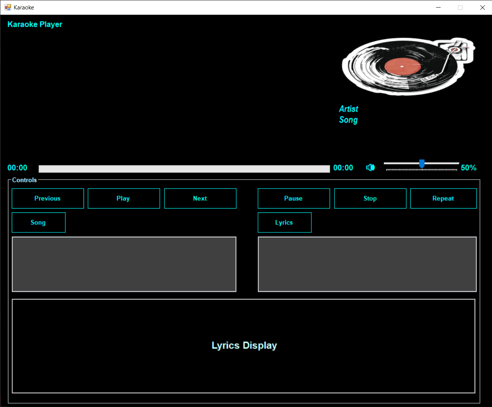
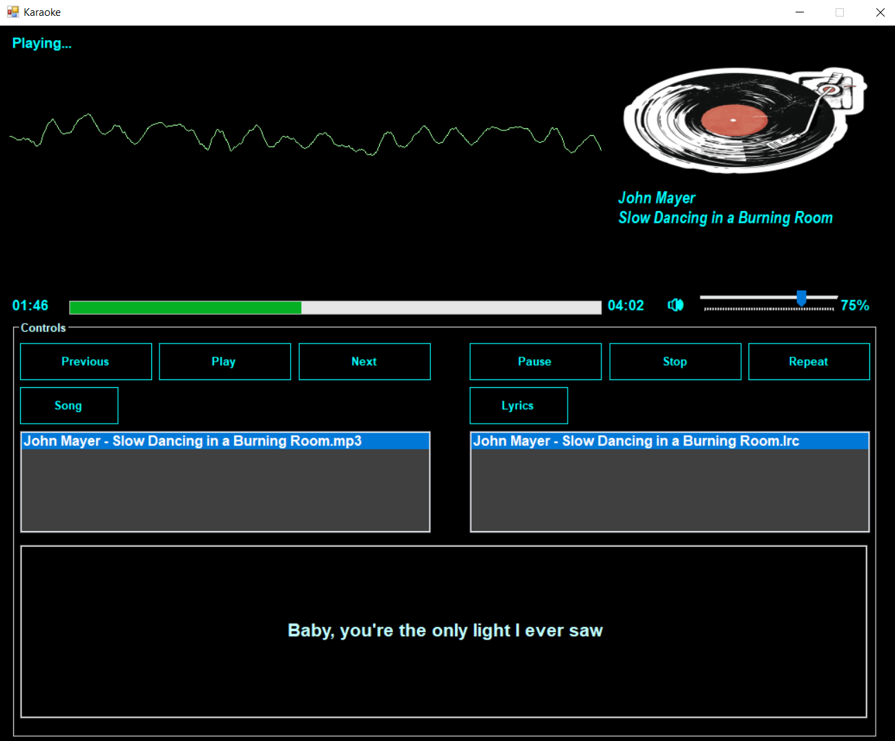

# Karaoke App

This karaoke app is a Windows Forms application that brings the karaoke experience to your PC. 
Sing along to your favorite tracks with synchronized lyrics and intuitive controls—all in a clean, responsive interface.

---

## 🎵 Features

- **Play and Sing:** Load and sing along with your favorite songs.
- **Add Songs and Lyrics:** Add songs from the Songs and Lyrics folder. You have to add the songs and lyrics to the folders yourself.
- **Intuitive Controls:** Previous, Play, Next, Pause, Stop, Repeat.
- **Adjustable Volume:** Fine-tune playback volume.
- **Easy Setup:** Clone, build, and run—no complex setup required.

---

## 📸 Screenshots

### App Perview


### App (Playing Slow Dancing In a Burning Room by John Mayer)


---

## 🚀 Getting Started

### Prerequisites

- Windows 10 or later
- [Visual Studio 2019/2022](https://visualstudio.microsoft.com/) with .NET Desktop Development workload

### Installation

1. **Clone the repository:**
    ```
    git clone https://github.com/gjorgistamkov/Karaoke-Application.git
    ```
2. **Open the solution:**
    - Open `KaraokeApp.sln` in Visual Studio.

3. **Build and Run:**
    - Press `F5` or click **Start** to build and run the application.

---

## 🎤 Usage

1. **Add Songs:**  
   Place your karaoke tracks (e.g., MP3 files) in the `Songs` folder.
2. **Add Lyrics:**  
   Place your karaoke lyrics (e.g., LRC files) in the `Lyrics` folder.
3. **Sing Along:**  
   Select a song and start singing! Adjust the volume as needed.
4. **Enjoy:**  
   Host karaoke nights or practice your vocals at home.

---

## 📦 Including Songs

- To include songs, add your audio files to the `Songs` folder in your project.
- To include lyrics, add your lyrics files to the `Lyrics` folder in your project.
  (Make sure to arrange the lyrics file to the song duration.)

---

Created by [Gjorgi Stamkov](https://github.com/gjorgistamkov)

---

*Enjoy singing with Karaoke App! 🎶*
